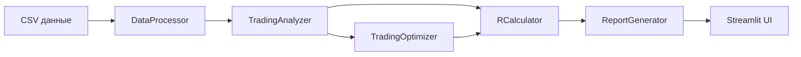

# Техническая документация Trading Analyzer v6.0

## 🏗 Архитектура системы

### Модульная структура

```
trading_analyzer/
├── app.py                 # Главное Streamlit приложение
├── data_processor.py      # Обработка и подготовка данных
├── analyzer.py           # Бизнес-логика анализа
├── r_calculator.py       # Расчеты R-метрики
├── report_generator.py   # Генерация отчетов
├── optimizer.py          # Оптимизация параметров
├── chart_visualizer.py   # Создание графиков
└── requirements.txt      # Зависимости
```

### Классы и их ответственность

#### DataProcessor
**Ответственность:** Подготовка и фильтрация данных
- Загрузка и валидация OHLC данных
- Обработка новостных данных
- Формирование БЛОКОВ
- Фильтрация торговых дней
- Проверка новостей

**Ключевые методы:**
- `get_block_range()` - расчет границ БЛОКА
- `get_session_data()` - получение свечей СЕССИИ
- `has_high_impact_news_in_day()` - проверка красных новостей
- `check_news_window()` - проверка новостного окна

#### TradingAnalyzer
**Ответственность:** Анализ торговых стратегий
- Определение типов входов
- Расчет уровней TP/SL
- Симуляция исполнения сделок
- Анализ периодов

**Ключевые методы:**
- `analyze_day()` - анализ одного дня
- `determine_entry_type()` - определение типа входа
- `calculate_trade_levels()` - расчет TP/SL
- `execute_trade()` - симуляция сделки
- `analyze_period()` - анализ периода

#### RCalculator
**Ответственность:** Расчеты R-метрики
- Вычисление R-результата для сделок
- Статистика по типам входов
- Базовые метрики

**Ключевые методы:**
- `calculate_r_result()` - расчет R для сделки
- `add_r_to_trades()` - добавление R к списку сделок
- `calculate_statistics_by_entry_type()` - статистика по типам

#### ReportGenerator
**Ответственность:** Создание отчетов
- Подготовка данных для отображения
- Генерация месячных/годовых отчетов
- Фильтрация результатов

**Ключевые методы:**
- `prepare_daily_trades()` - подготовка таблицы сделок
- `generate_monthly_report()` - месячный отчет
- `generate_yearly_report()` - годовой отчет
- `generate_summary_report()` - общий отчет

#### TradingOptimizer
**Ответственность:** Оптимизация параметров
- Перебор комбинаций TP/SL
- Параллельная обработка
- Кеширование результатов

**Ключевые методы:**
- `optimize_parameters()` - основной метод оптимизации
- `run_single_combination()` - расчет одной комбинации
- `get_top_combinations()` - получение лучших результатов

#### ChartVisualizer
**Ответственность:** Визуализация данных
- Создание интерактивных графиков
- Тепловые карты
- Накопительные графики

**Ключевые методы:**
- `create_cumulative_r_chart()` - накопительный график
- `create_yearly_cumulative_chart()` - годовой график
- `create_entry_type_pie_chart()` - распределение по типам

## 🔄 Поток данных



## 📝 Основные алгоритмы

### Формирование БЛОКА

```python
def get_block_range(date, block_start, block_end, from_previous_day=False):
    """
    1. Определяем дату начала (текущая или предыдущая)
    2. Создаем datetime границы
    3. Фильтруем свечи в диапазоне
    4. Находим high и low
    5. Возвращаем границы и размер
    """
```

### Определение типа входа

```python
def determine_entry_type(session_candles, block_range, start_position, use_return_mode):
    """
    1. Определяем стартовую позицию (INSIDE/ABOVE/BELOW)
    2. Проходим по свечам сессии
    3. Проверяем касания границ
    4. В зависимости от режима и позиции определяем тип входа
    5. Возвращаем тип и параметры входа
    """
```

### Расчет R-метрики

```python
def calculate_r_result(trade, tp_coefficient):
    """
    1. Определяем размер риска (SL)
    2. Определяем фактический результат
    3. Вычисляем R = результат / риск
    4. Применяем коэффициент для TP
    5. Возвращаем R-результат
    """
```

## 🔧 Новые функции v6.0.2

### БЛОК с предыдущего дня

**Изменения в `data_processor.py`:**
```python
def get_block_range(self, date, block_start, block_end, from_previous_day=False):
    if from_previous_day:
        block_start_date = date - timedelta(days=1)
    else:
        block_start_date = date
```

**Использование:**
- Параметр передается из настроек UI
- Автоматически корректирует даты при формировании БЛОКА
- Не влияет на СЕССИЮ (всегда текущий день)

### Пропуск дней с красными новостями

**Новый метод в `data_processor.py`:**
```python
def has_high_impact_news_in_day(self, check_date, currency_filter=None):
    """
    1. Фильтруем новости по дате
    2. Оставляем только high impact
    3. Фильтруем по валютам если указаны
    4. Возвращаем True если есть красные новости
    """
```

**Использование в `analyzer.py`:**
```python
if settings.get('skip_red_news_days', False):
    if self.data_processor.has_high_impact_news_in_day(date, currency_filter):
        return None  # Пропускаем день
```

## 🎯 Оптимизация производительности

### Кеширование
- Session state Streamlit для сохранения результатов
- Кеш оптимизатора для избежания повторных расчетов
- Предварительная фильтрация данных

### Параллельная обработка
```python
with ThreadPoolExecutor(max_workers=cpu_count) as executor:
    futures = []
    for combination in combinations:
        future = executor.submit(self.run_single_combination, combination)
        futures.append(future)
```

### Векторизация
- Использование pandas операций вместо циклов где возможно
- NumPy для математических расчетов
- Групповые операции для статистики

## 🐛 Обработка ошибок

### Уровни логирования
- `DEBUG` - детальная информация о процессе
- `INFO` - важные события
- `WARNING` - потенциальные проблемы
- `ERROR` - ошибки выполнения

### Валидация данных
```python
# Проверка обязательных колонок
required_columns = ['timestamp', 'open', 'high', 'low', 'close']
if not all(col in df.columns for col in required_columns):
    raise ValueError(f"Отсутствуют колонки: {required_columns}")

# Проверка корректности OHLC
invalid = df[(df['high'] < df['low']) | 
            (df['high'] < df['open']) | 
            (df['high'] < df['close'])]
```

## 🔒 Безопасность

### Обработка файлов
- Ограничение размера загружаемых файлов
- Проверка формата перед обработкой
- Безопасное чтение CSV через pandas

### Валидация входных данных
- Проверка типов данных
- Ограничение диапазонов значений
- Защита от SQL инъекций (не применимо, но good practice)

## 📊 Форматы данных

### Структура результата анализа дня
```python
{
    'date': datetime.date,
    'range_high': float,
    'range_low': float,
    'range_size': float,
    'start_position': str,  # INSIDE/ABOVE/BELOW
    'entry_type': str,      # ENTRY_LONG_TREND и т.д.
    'entry_price': float,
    'entry_time': datetime,
    'tp_price': float,
    'sl_price': float,
    'exit_price': float,
    'exit_time': datetime,
    'result': str,          # TP/SL/BE/NO_TRADE
    'pnl': float,
    'close_reason': str,
    'r_result': float
}
```

### Структура настроек
```python
{
    'block_start': time,
    'block_end': time,
    'session_start': time,
    'session_end': time,
    'use_return_mode': bool,
    'trading_days': List[int],
    'tp_multiplier': float,
    'sl_multiplier': float,
    'tp_coefficient': float,
    'min_range_size': float,
    'max_range_size': float,
    'use_news_filter': bool,
    'news_impact_filter': List[str],
    'news_buffer_minutes': int,
    'news_currency_filter': List[str],
    'use_fixed_tp_sl': bool,
    'threshold_min': float,
    'threshold_max': float,
    'fixed_tp_distance': float,
    'fixed_sl_distance': float,
    'from_previous_day': bool,
    'skip_red_news_days': bool
}
```

## 🚀 Развертывание

### Локальный запуск
```bash
pip install -r requirements.txt
streamlit run app.py
```

### Docker (пример)
```dockerfile
FROM python:3.8-slim
WORKDIR /app
COPY requirements.txt .
RUN pip install -r requirements.txt
COPY . .
CMD ["streamlit", "run", "app.py"]
```

### Переменные окружения
```bash
export STREAMLIT_SERVER_PORT=8501
export STREAMLIT_SERVER_ADDRESS=0.0.0.0
```

## 📈 Метрики производительности

### Ожидаемая производительность
- Анализ 1 года данных: ~2-5 секунд
- Оптимизация 100 комбинаций: ~10-30 секунд
- Загрузка 100k свечей: ~1 секунда

### Ограничения
- Максимум данных: ~1 млн свечей
- Максимум комбинаций оптимизации: 10000
- Максимум параллельных потоков: CPU cores × 2

## 🔮 Планы развития

### Ближайшие улучшения
- [ ] Поддержка множественных инструментов
- [ ] Экспорт в Excel с форматированием
- [ ] API для автоматической торговли
- [ ] Бэктестинг с учетом спредов

### Долгосрочные планы
- [ ] Машинное обучение для предсказаний
- [ ] Веб-версия с базой данных
- [ ] Интеграция с брокерами
- [ ] Мобильное приложение